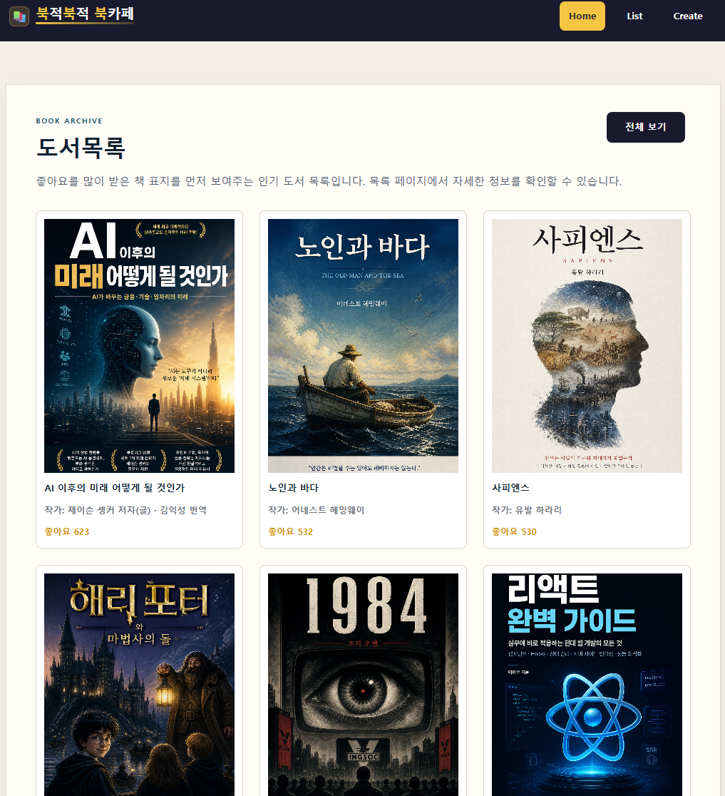
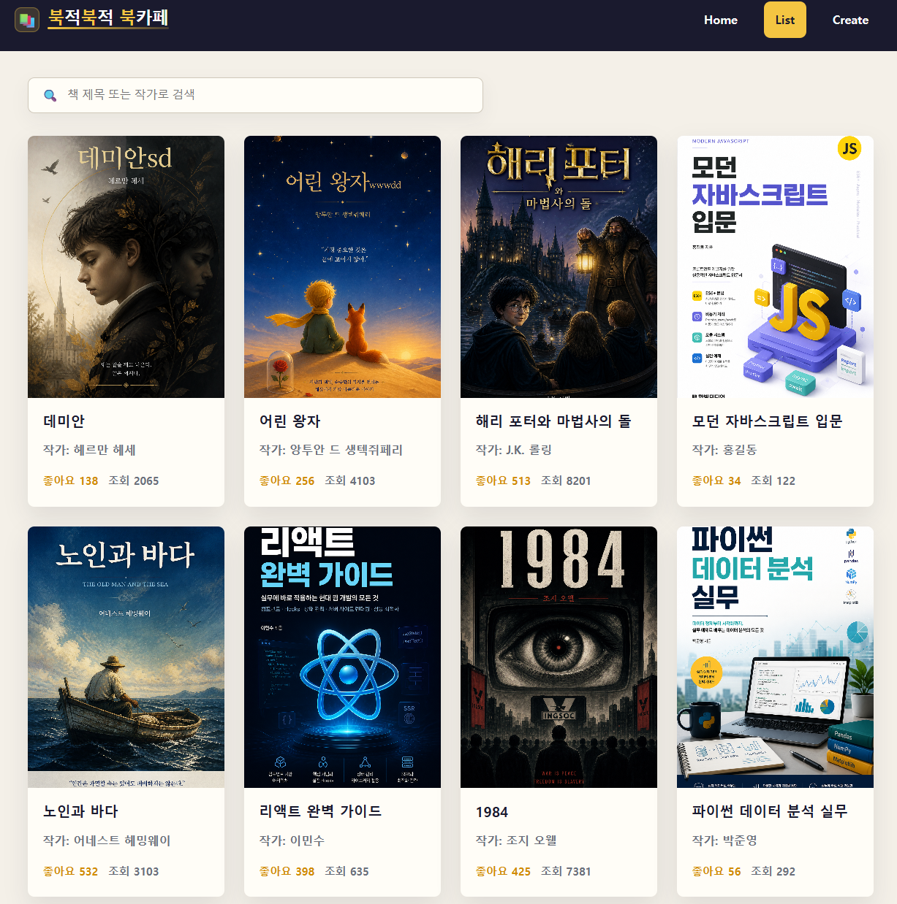
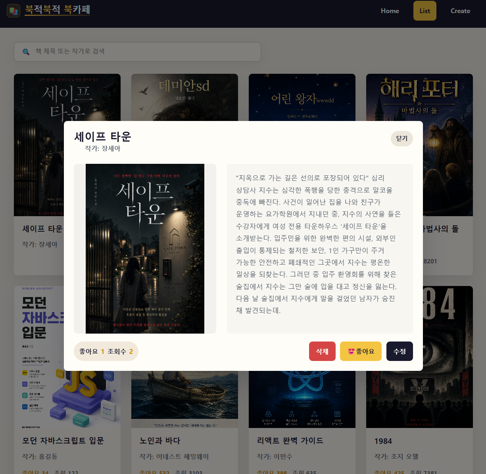
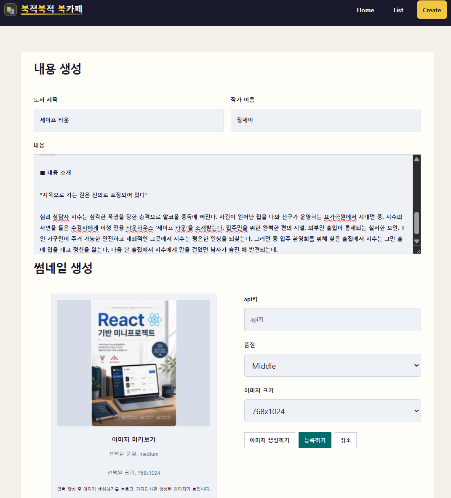
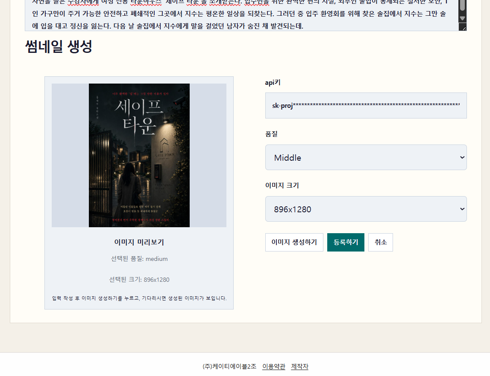
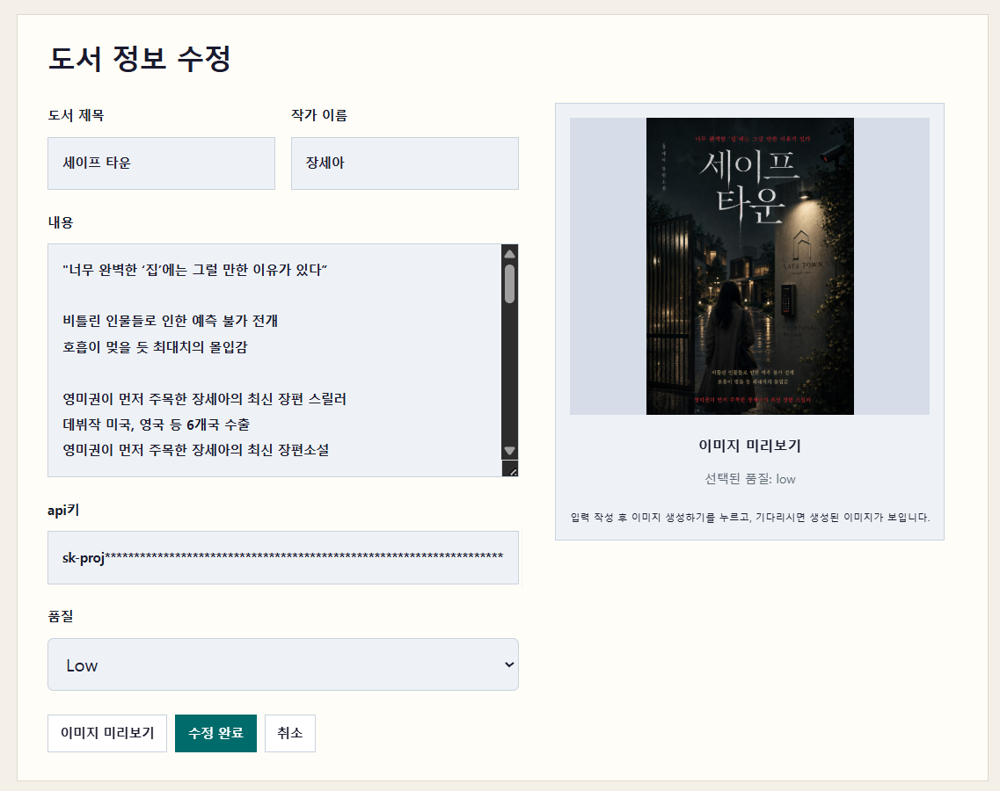

# 북적 Book적 Book카페 - 도서관리 시스템

AI 표지 이미지 생성을 지원하는 React 기반 도서관리 웹 애플리케이션입니다.

도서 등록, 목록 조회, 검색, 상세보기 모달, 수정, 삭제, 좋아요, 조회수 기능을 제공하며, OpenAI 이미지 생성 API를 활용해 도서 내용에 어울리는 표지 이미지를 생성합니다.

본 프로젝트는 KT AIVLE School AI 트랙 미니프로젝트 4차 과제인  
**도서관리시스템 개발 (AI를 활용한 도서표지 이미지 생성)** 을 기반으로 진행했습니다.

---

# 1. 프로젝트 개요

## 1.1 프로젝트명

**북적 Book적 Book카페 - 도서관리 시스템**

---

## 1.2 프로젝트 목적

사용자가 도서 정보를 등록하고 관리할 수 있는 React 기반 SPA를 구현합니다.

단순한 텍스트 중심 도서 관리에서 나아가, AI 표지 이미지 생성 기능을 통해 도서의 분위기와 내용을 시각적으로 표현하는 것을 목표로 합니다.

---

## 1.3 프로젝트 배경

기존 도서 관리 기능은 제목, 작가, 내용 등 텍스트 데이터 관리에 초점이 맞춰져 있습니다.

하지만 사용자가 목록에서 여러 도서를 확인할 때 표지 이미지가 함께 표시되면 도서의 분위기와 내용을 더 빠르게 파악할 수 있습니다.

이에 따라 OpenAI 이미지 생성 API를 활용하여 도서 제목과 내용을 기반으로 표지 이미지를 생성하고, 생성 결과를 도서 데이터와 함께 관리하는 방향으로 구현했습니다.

---

## 1.4 주요 기능

- 도서 목록 조회
- 도서 제목 / 작가 기준 검색
- 도서 상세보기 모달
- 도서 등록
- 도서 수정
- 도서 삭제
- 좋아요 기능
- 조회수 기능
- AI 표지 이미지 생성
- 이미지 생성 비용 안내
- 이미지 품질 옵션 선택
- 이미지 크기 옵션 선택

---

## 1.5 최종 산출물

| 산출물 | 설명 |
|---|---|
| 소스코드 | React + json-server 기반 프로젝트 |
| README.md | 프로젝트 개요, 실행 방법, 기능 설명 |
| docs 문서 | 기능 설명 및 구조 문서 |
| 발표자료 | 서비스 개요, 데이터 구조, 구현 결과 |
| 실행 화면 캡처 | Home, 목록, 상세, 등록, 수정 화면 |

---

# 2. 기술 스택

| 구분 | 기술 |
|---|---|
| Frontend | React, Vite |
| Routing | React Router DOM |
| API 요청 | Fetch API |
| Mock REST API | json-server |
| DB 역할 | db.json |
| AI 이미지 생성 | OpenAI Images API |
| 스타일 | CSS |

---

## 2.1 기술 선택 이유

| 기술 | 선택 이유 |
|---|---|
| React | 컴포넌트 기반 UI 구성에 적합 |
| Vite | 빠른 개발 서버 및 간단한 실행 환경 제공 |
| React Router DOM | SPA 라우팅 구성 가능 |
| Fetch API | 별도 라이브러리 없이 REST API 요청 가능 |
| json-server | 빠르게 Mock REST API 구성 가능 |
| OpenAI Images API | 도서 기반 AI 이미지 생성 가능 |

---

# 3. 시스템 구조

```text
React Frontend
├─ 도서 CRUD 요청
│  └─ json-server
│     └─ db.json
│
└─ AI 이미지 생성 요청
   └─ OpenAI Images API
```

---

## 3.1 핵심 구조

- React는 `json-server`의 `/books` API를 호출하여 CRUD를 수행합니다.
- OpenAI Images API를 직접 호출하여 AI 표지 이미지를 생성합니다.
- OpenAI 응답의 `b64_json`을 `data:image/png;base64,...` 형태로 변환하여 저장합니다.
- 생성된 이미지는 `coverImageUrl` 필드에 저장됩니다.

---

## 3.2 요청 흐름

### 도서 데이터 흐름

```text
React
→ fetch()
→ http://localhost:3000/books
→ json-server
→ db.json
```

### AI 이미지 생성 흐름

```text
React
→ OpenAI Images API
→ b64_json 응답
→ React에서 Data URL 변환
→ coverImageUrl 저장
→ POST/PATCH /books
→ db.json 저장
```

---

## 3.3 실행 프로세스 역할

| 프로세스 | 실행 명령어 | 역할 |
|---|---|---|
| React 개발 서버 | `npm run dev` | 브라우저 화면 제공 |
| json-server | `npx json-server --watch db.json --port 3000` | CRUD API 제공 |

---

# 4. 실행 방법 가이드

## 4.1 패키지 설치

```bash
npm install
```

---

## 4.2 json-server 실행

```bash
npx json-server --watch db.json --port 3000
```

확인 주소:

```text
http://localhost:3000/books
```

---

## 4.3 React 개발 서버 실행

```bash
npm run dev
```

기본 접속 주소:

```text
http://localhost:5173
```

---

## 4.4 OpenAI API Key 입력

현재 프로젝트는 학습용 프론트엔드 구조로,  
브라우저 화면의 API Key 입력창에 직접 Key를 입력하여 사용합니다.

주의사항:

- API Key를 GitHub에 업로드하지 않습니다.
- 실서비스에서는 백엔드 또는 프록시 서버 사용이 권장됩니다.
- 사용량 및 과금 상태를 반드시 확인합니다.

---

## 4.5 실행 체크리스트

- [ ] `npm install` 완료
- [ ] json-server 실행 완료
- [ ] `http://localhost:3000/books` 접속 가능
- [ ] React 개발 서버 실행 완료
- [ ] `http://localhost:5173` 접속 가능
- [ ] OpenAI API Key 입력 완료

---

# 5. 주요 화면

## 5.1 Home 화면

- 서비스 메인 화면
- 인기 도서 표시
- 전체 도서 목록 이동



---

## 5.2 List 화면

- 도서 목록 표시
- 제목 / 작가 검색
- 상세보기 모달 표시



---

## 5.3 상세보기 모달

표시 정보:

- 도서 제목
- 작가
- 도서 내용
- 표지 이미지
- 좋아요 수
- 조회수
- 생성일
- 수정일

제공 기능:

- 좋아요 증가
- 조회수 증가
- 수정 화면 이동
- 삭제 기능



---

## 5.4 Create 화면

입력 및 기능:

- 제목 입력
- 작가 입력
- 내용 입력
- API Key 입력
- 이미지 품질 선택
- AI 이미지 생성
- 생성 이미지 미리보기
- 도서 등록





---

## 5.5 Update 화면

- 기존 도서 정보 조회
- AI 표지 재생성
- PATCH 기반 수정 처리
- 수정 완료 후 목록 복귀



---

# 6. 주요 기능 상세

## 6.1 도서 목록 조회

```http
GET /books
```

도서 목록 데이터를 조회하여 화면 상태에 저장합니다.

---

## 6.2 도서 검색

검색 대상:

```text
title, author
```

검색 결과가 없으면 별도의 안내 문구를 표시합니다.

---

## 6.3 도서 상세보기

도서 카드를 클릭하면 상세보기 모달이 열립니다.

상세보기 모달에서는:

- 좋아요 증가
- 조회수 증가
- 수정
- 삭제

기능을 수행할 수 있습니다.

---

## 6.4 도서 등록

```http
POST /books
```

등록 데이터 예시:

```json
{
  "id": 1,
  "title": "도서 제목",
  "author": "작가 이름",
  "content": "도서 내용",
  "coverImageUrl": "data:image/png;base64,...",
  "likes": 0,
  "views": 0,
  "createdAt": "2026-05-27T00:00:00.000Z",
  "updatedAt": "2026-05-27T00:00:00.000Z"
}
```

---

## 6.5 도서 수정

```http
PATCH /books/:id
```

수정 항목:

- 제목
- 작가
- 내용
- 표지 이미지
- 수정일

---

## 6.6 도서 삭제

```http
DELETE /books/:id
```

삭제 후 프론트 상태에서도 즉시 제거되도록 처리합니다.

---

## 6.7 좋아요 기능

```http
PATCH /books/:id
```

`likes` 값을 증가시킵니다.

---

## 6.8 조회수 기능

```http
PATCH /books/:id
```

상세보기 모달 진입 시 `views` 값을 증가시킵니다.

---

## 6.9 AI 표지 이미지 생성

처리 흐름:

```text
1. 사용자가 제목/작가/내용 입력
2. 이미지 옵션 선택
3. OpenAI API 요청
4. b64_json 응답 수신
5. Data URL 변환
6. coverImageUrl 저장
7. 등록 또는 수정 시 db.json 저장
```

생성 이미지는 base64 Data URL 형태로 저장될 수 있습니다.

---

# 7. API 명세 요약

## 7.1 json-server

```text
Base URL: http://localhost:3000
Resource: /books
```

| 기능 | Method | Endpoint |
|---|---|---|
| 도서 목록 조회 | GET | `/books` |
| 도서 상세 조회 | GET | `/books/:id` |
| 도서 등록 | POST | `/books` |
| 도서 수정 | PATCH | `/books/:id` |
| 도서 삭제 | DELETE | `/books/:id` |

---

# 8. 데이터 구조

```json
{
  "id": 1,
  "title": "도서 제목",
  "author": "작가 이름",
  "content": "도서 내용",
  "coverImageUrl": "data:image/png;base64,...",
  "likes": 0,
  "views": 0,
  "createdAt": "2026-05-27T00:00:00.000Z",
  "updatedAt": "2026-05-27T00:00:00.000Z"
}
```

---

# 9. 프로젝트 폴더 구조

```text
project4-main/
├── db.json
├── package.json
├── README.md
├── docs/
│   ├── API.md
│   ├── FEATURES.md
│   ├── FRONTEND_STRUCTURE.md
│   ├── IMAGE_GENERATION.md
│   ├── PROJECT_OVERVIEW.md
│   ├── RUN_GUIDE.md
│   └── TROUBLESHOOTING.md
├── public/
├── src/
│   ├── App.jsx
│   ├── components/
│   ├── views/
│   └── assets/
```

---

# 10. 트러블슈팅 핵심 정리

## 10.1 Payload 용량 초과 문제

base64 이미지 저장 시 Payload 크기가 매우 커질 수 있습니다.

대표 증상:

```text
PayloadTooLargeError
request entity too large
```

해결 방향:

- 이미지 품질 낮추기
- 이미지 크기 줄이기
- 너무 큰 이미지 저장 제한

---

## 10.2 json-server 응답 오류

```text
Unexpected token '<', "<!DOCTYPE "... is not valid JSON
```

원인:

- API 요청이 json-server가 아니라 Vite 서버로 전달된 경우

확인 사항:

- `json-server` 실행 여부
- API URL 확인
- 포트 번호 확인

---

## 10.3 OpenAI 이미지 생성 실패

확인 사항:

- API Key 입력 여부
- OpenAI 사용량 상태
- 네트워크 연결 상태
- fetch 요청 구조 확인

---

# 11. 팀 프로젝트 역할 분담

| 역할 | 담당 내용 |
|---|---|
| PM / 기획 | 요구사항 정의, 일정 관리 |
| UI / 레이아웃 | 화면 구조 및 공통 컴포넌트 |
| CRUD 연동 | json-server 및 CRUD API 연동 |
| OpenAI 연동 | AI 이미지 생성 기능 |
| 스타일링 / QA | CSS 및 기능 테스트 |
| 발표 / 문서 | README 및 발표자료 작성 |

---

# 12. 프로젝트 진행 과정

## 12.1 기본 구조 설계

- 요구사항 분석
- 데이터 구조 정의
- 화면 구조 설계
- React + Vite 구성
- json-server 설정

---

## 12.2 CRUD 기능 구현

- 목록 조회
- 등록
- 수정
- 삭제
- 좋아요 / 조회수 기능
- 상세보기 모달 구현

---

## 12.3 AI 이미지 생성 연동

- 프롬프트 구성
- OpenAI API 연동
- base64 저장 처리
- 이미지 생성 UX 개선

---

## 12.4 문서화 및 마무리

- README 정리
- docs 문서 최신화
- 실행 가이드 작성
- 발표자료 정리

---

# 13. 프로젝트 회고

이번 프로젝트를 통해:

- React 컴포넌트 구조
- 상태 관리
- json-server 기반 CRUD
- Fetch API 활용
- OpenAI API 연동
- AI 이미지 생성 흐름

을 하나의 프로젝트 안에서 경험할 수 있었습니다.

특히 CRUD 기능과 AI 기능을 결합하면서 단순 데이터 관리가 아닌 사용자 경험 중심 기능 설계의 중요성을 확인할 수 있었습니다.
